# ActionRail Finance — Complete Demo Workflow

> **Purpose:** Step-by-step walkthrough to demonstrate ActionRail as an agent-facing finance action gateway.
> Every step below was verified live on 2026-06-14 against the current codebase (256/256 tests passing).
> Screenshots captured on 2026-06-15 using automated Selenium + Edge headless.

## Screenshot status

| # | File | Status | Notes |
|---|---|---|---|
| 00 | `docs/demo_captures/00-health-check.png` | Captured | Health endpoint JSON response |
| 01 | `docs/demo_captures/01-preflight-response.png` | Pending manual capture | Terminal/API output, not a web page |
| 02 | `docs/demo_captures/02-login-page.png` | Captured | Login form with demo credentials |
| 03 | `docs/demo_captures/03-dashboard-with-transaction.png` | Captured | Dashboard with stat cards, transaction queue, demo preflight buttons |
| 04 | `docs/demo_captures/04-transaction-detail.png` | Captured | Transaction detail with 7 checks, decision, risk, approval section |
| 05 | `docs/demo_captures/05-approved-transaction.png` | Captured | Approved state with Execute button visible |
| 06 | `docs/demo_captures/06-executed-transaction.png` | Captured | Executed state with View Receipt button |
| 07 | `docs/demo_captures/07-signed-receipt.png` | Captured | HMAC-SHA256 signature and canonical JSON payload |
| 08 | `docs/demo_captures/08-accounting-writeback.png` | Captured | Draft bill, audit packet, sandbox safety note |
| 09 | `docs/demo_captures/09-blocked-duplicate.png` | Captured | Blocked decision, high risk, duplicate evidence |
| 10 | `docs/demo_captures/10-needs-evidence.png` | Captured | needs_more_evidence decision, missing evidence check |
| 11 | `docs/demo_captures/11-evidence-pack-download.png` | Captured | Transaction detail with evidence pack download button |
| 12 | `docs/demo_captures/12-policy-replay.png` | Captured | Replay page with policy re-evaluation |
| 13 | `docs/demo_captures/13-risk-monitor.png` | Captured | Operational metrics and security events |
| 14 | `docs/demo_captures/14-audit-log.png` | Captured | Event timeline with login, approval, execution events |
| 15 | `docs/demo_captures/15-admin-dashboard.png` | Captured | Admin control plane with vendor/contract/policy/API sections |
| 16 | `docs/demo_captures/16-agent-integration-docs.png` | Captured | Agent Integration Guide markdown rendered in browser |

**Captured: 16/17.** Only `01-preflight-response.png` requires manual terminal capture.

---

## Prerequisites

| Requirement | Why |
|---|---|
| Python 3.10+ with `venv` | Runtime |
| `pip install -r requirements.txt` | Dependencies (FastAPI, uvicorn, Pydantic, Jinja2, pytest) |
| Terminal (PowerShell or bash) | CLI demo commands |
| Browser (any modern) | Dashboard control plane |
| No external services needed | Everything runs locally on SQLite |

---

## Phase 0: Reset and Start

### 0.1 Reset the demo database

```powershell
# Windows PowerShell
$env:PYTHONIOENCODING='utf-8'
python scripts/reset_demo_db.py
```

```bash
# Linux / macOS
python scripts/reset_demo_db.py
```

**Expected output:**

```text
ActionRail Finance — demo DB reset
Target: <project_root>/actionrail.db
  ✓ Dropped project tables: api_request_events, idempotency_records, api_clients, ...
  ✓ Schema recreated.
  ✓ Seed data loaded (vendors, contracts, default policy, demo users, INV-1042 historical invoice).
Done. Reset <project_root>/actionrail.db.
```

### 0.2 Start the server

```powershell
uvicorn app.main:app --reload
```

**Expected output:**

```text
INFO:     Uvicorn running on http://127.0.0.1:8000
INFO:     Application startup complete.
```

### 0.3 Verify health

```powershell
curl.exe -s http://127.0.0.1:8000/health
```

**Expected response:**

```json
{"status":"ok","service":"actionrail-finance"}
```

📸 **Screenshot:** `00-health-check.png`

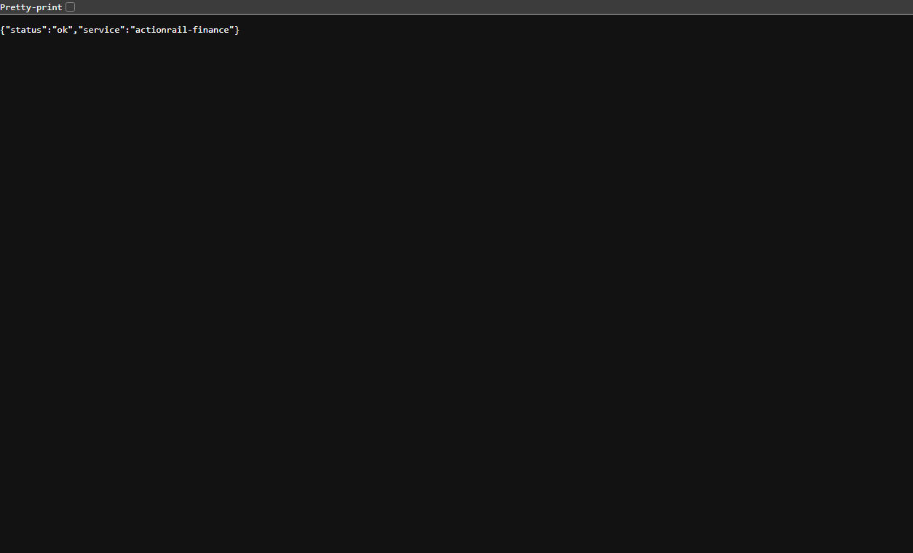

---

## Phase 1: Agent Calls the API (Preflight)

This is the core ActionRail primitive. The AI agent calls `POST /actions/preflight` before performing any finance action.

### 1.1 Submit an invoice for preflight

```powershell
curl.exe -s -X POST http://127.0.0.1:8000/actions/preflight `
  -H "Content-Type: application/json" `
  -H "Idempotency-Key: demo-wf-001" `
  -d "@examples/invoice_approval_required.json"
```

**Expected response (key fields):**

```json
{
  "transaction_id": "txn_<hash>",
  "decision": "approval_required",
  "risk": "medium",
  "checks": [
    {"name": "action_allowed", "status": "passed"},
    {"name": "vendor_verified", "status": "passed"},
    {"name": "duplicate_invoice", "status": "passed"},
    {"name": "contract_match", "status": "passed"},
    {"name": "amount_policy", "status": "warning", "message": "Amount exceeds approval threshold."},
    {"name": "evidence_attached", "status": "passed"},
    {"name": "intent_lock", "status": "passed"}
  ],
  "allowed_next_action": "request_finance_approval",
  "blocked_actions": ["execute_without_approval"]
}
```

**What this proves:** The agent receives a structured, machine-readable decision. It cannot proceed to execution without human approval. Seven policy checks ran deterministically.

📸 **Screenshot:** `01-preflight-response.png` — **Pending manual capture** (terminal/API output, not a web page)

**Save the transaction ID** — you will use it in the next steps. Example: `txn_b9074e992c3d`

---

## Phase 2: Human Control Plane (Dashboard)

### 2.1 Login

Open browser to: `http://127.0.0.1:8000/login`

| Role | Email | Password |
|---|---|---|
| Admin | `admin@example.local` | `admin123` |
| Controller | `controller@example.local` | `controller123` |
| Approver | `approver@example.local` | `approver123` |
| Executor | `executor@example.local` | `executor123` |
| Auditor | `auditor@example.local` | `auditor123` |
| Viewer | `viewer@example.local` | `viewer123` |

Login as **admin** (has all permissions) for the first walkthrough.

📸 **Screenshot:** `02-login-page.png`

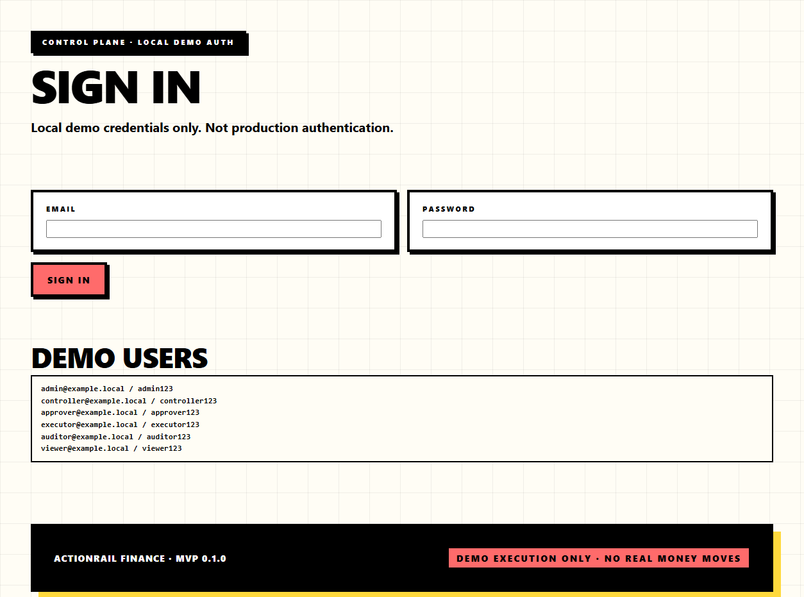

### 2.2 Dashboard overview

After login, you are redirected to `http://127.0.0.1:8000/dashboard`.

**What you see:**

- **Stat cards** at the top: Total, Approval Required, Needs Evidence, Blocked, Executed
- **Transaction queue** table listing the transaction you just created via the API
- The transaction shows: `decision = approval_required`, `risk = medium`, `status = preflighted`

📸 **Screenshot:** `03-dashboard-with-transaction.png`

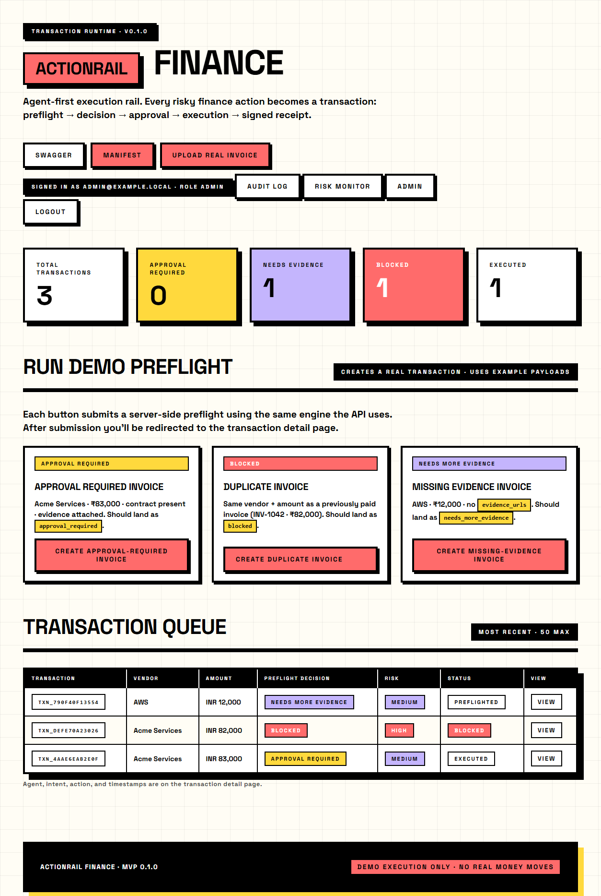

### 2.3 Transaction detail

Click the transaction row to view `http://127.0.0.1:8000/dashboard/transactions/<txn_id>`.

**What you see:**

- Transaction ID, agent ID, user ID
- Intent and action
- Vendor name and amount
- **Decision:** `approval_required`
- **Risk level:** `medium`
- **Status:** `preflighted`
- **7 policy checks** with pass/fail/warning status and evidence
- Approval workflow state (pending steps)
- Allowed next action
- Audit trail (timeline of events)
- Buttons: **Approve** and **Reject** (visible because decision is `approval_required`)

📸 **Screenshot:** `04-transaction-detail.png`

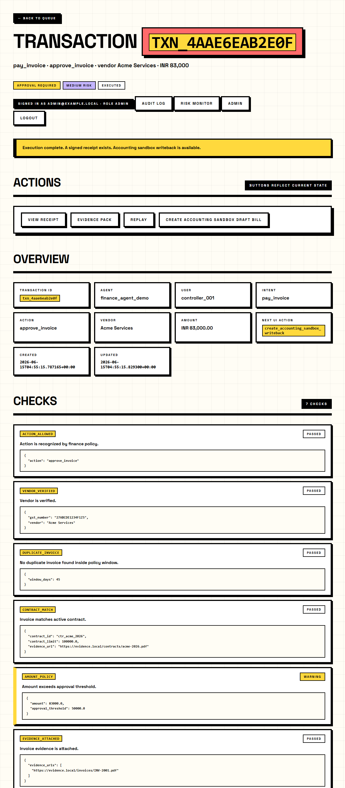

---

## Phase 3: Approval Workflow

### 3.1 Approve via dashboard

Click **Approve** on the transaction detail page.

**Result:** Transaction status changes to `approved`. The Approve/Reject buttons disappear. The Execute button appears.

📸 **Screenshot:** `05-approved-transaction.png`

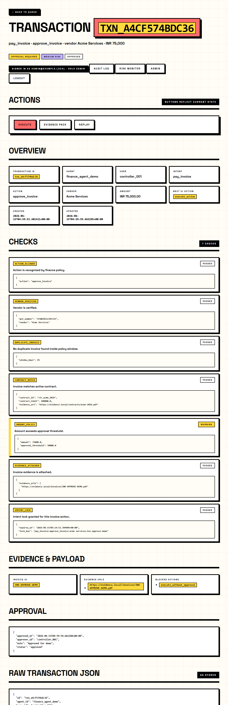

### 3.2 Approve via API (alternative)

Instead of the dashboard, an agent or system can approve via the JSON API:

```powershell
# Write JSON body to file (avoids PowerShell escaping issues)
Set-Content -Path "temp.json" -Value '{"approver_id":"controller_001","note":"Verified OK"}' -Encoding UTF8

curl.exe -s -X POST "http://127.0.0.1:8000/approvals/<TXN_ID>/approve" `
  -H "Content-Type: application/json" `
  -d "@temp.json"
```

**Expected response:**

```json
{
  "transaction_id": "txn_<hash>",
  "status": "approved",
  "approval": {
    "status": "approved",
    "approver_id": "controller_001",
    "note": "Verified OK",
    "approved_at": "2026-06-14T..."
  }
}
```

### 3.3 Maker-checker separation

If the approval workflow requires maker-checker (2-step approval), the same user who created the transaction cannot approve it. Log out, log in as `approver@example.local`, and approve from a different identity.

---

## Phase 4: Simulated Execution

### 4.1 Execute via dashboard

On the approved transaction detail page, click **Execute**.

**Result:** Transaction status changes to `executed`. The signed receipt is generated. A "View Receipt" button appears.

> **SAFETY BOUNDARY:** No real money moves. Execution is simulated. The response includes:
> `"Demo execution only. No real bank or ledger mutation performed."`

📸 **Screenshot:** `06-executed-transaction.png`


### 4.2 Execute via API (alternative)

```powershell
curl.exe -s -X POST "http://127.0.0.1:8000/actions/<TXN_ID>/execute"
```

**Expected response (key fields):**

```json
{
  "transaction_id": "txn_<hash>",
  "status": "executed",
  "receipt": {
    "receipt_id": "rcpt_<hash>",
    "receipt_signature": "<HMAC-SHA256 hex>",
    "payload": {
      "decision": "approval_required",
      "invoice": { "vendor": "Acme Services", "amount": 83000.0 },
      "approval": { "status": "approved" },
      "execution": {
        "status": "executed",
        "note": "Demo execution only. No real bank or ledger mutation performed."
      }
    }
  }
}
```

---

## Phase 5: Signed Receipt

### 5.1 View receipt via dashboard

Click **View Receipt** on the executed transaction page.

**What you see:**

- Receipt ID
- Transaction ID
- HMAC-SHA256 signature (hex)
- Canonical JSON payload including: decision, invoice, approval, execution
- The safety boundary note: `"Demo execution only. No real bank or ledger mutation performed."`

📸 **Screenshot:** `07-signed-receipt.png`

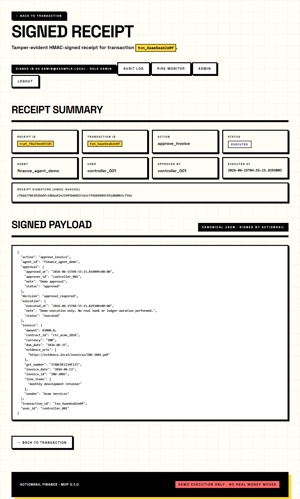

### 5.2 View receipt via API

```powershell
curl.exe -s "http://127.0.0.1:8000/receipts/<TXN_ID>"
```

**What this proves:** Both the agent and auditor have verifiable proof of what happened. The HMAC signature covers the canonical payload — any tampering changes the signature.

---

## Phase 6: Accounting Sandbox Writeback

### 6.1 Create writeback

On the executed transaction detail page, click **Create Accounting Sandbox Draft Bill**.

**What you see:**

- Safety banner: `"Local accounting sandbox only. No external ERP, bank, or ledger mutation."`
- Draft bill JSON (transaction details, amounts, vendor)
- Audit packet JSON (policy checks, approval, receipt reference)
- `local://` references (no absolute paths leaked)

📸 **Screenshot:** `08-accounting-writeback.png`

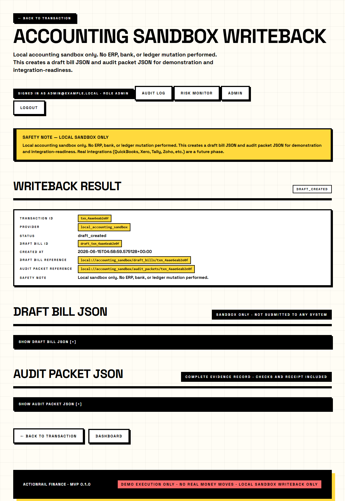

### 6.2 Idempotency

Return to the transaction detail page. The button now says **View Accounting Sandbox Writeback** instead of "Create". Clicking it again shows the same writeback — no duplicates are created.

---

## Phase 7: Duplicate Invoice (Blocked Flow)

### 7.1 Submit duplicate invoice

```powershell
curl.exe -s -X POST http://127.0.0.1:8000/actions/preflight `
  -H "Content-Type: application/json" `
  -H "Idempotency-Key: demo-wf-002" `
  -d "@examples/invoice_duplicate_blocked.json"
```

**Expected response (key fields):**

```json
{
  "transaction_id": "txn_<hash>",
  "decision": "blocked",
  "risk": "high",
  "checks": [
    {"name": "duplicate_invoice", "status": "failed",
     "message": "Possible duplicate invoice found with same vendor and amount.",
     "evidence": {"matches": [{"invoice_id": "INV-1042", "amount": 82000.0, "status": "paid"}]}}
  ],
  "allowed_next_action": "send_to_human_review",
  "blocked_actions": ["execute_action"]
}
```

**What this proves:** ActionRail blocks the action before any damage is possible. The agent receives `decision=blocked` with the conflicting invoice as evidence. No execute button appears on the dashboard.

📸 **Screenshot:** `09-blocked-duplicate.png`

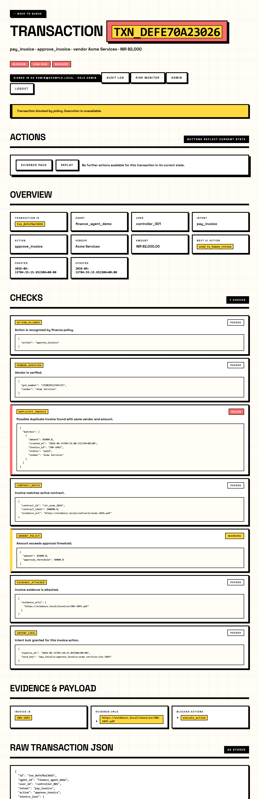

---

## Phase 8: Missing Evidence (Needs More Evidence Flow)

### 8.1 Submit invoice without evidence

```powershell
curl.exe -s -X POST http://127.0.0.1:8000/actions/preflight `
  -H "Content-Type: application/json" `
  -H "Idempotency-Key: demo-wf-003" `
  -d "@examples/invoice_missing_evidence.json"
```

**Expected response (key fields):**

```json
{
  "transaction_id": "txn_<hash>",
  "decision": "needs_more_evidence",
  "risk": "medium",
  "checks": [
    {"name": "evidence_attached", "status": "needs_evidence",
     "message": "No invoice evidence URL or document reference attached."}
  ],
  "allowed_next_action": "attach_missing_evidence_and_rerun_preflight",
  "blocked_actions": ["execute_action"]
}
```

**What this proves:** ActionRail returns `needs_more_evidence`. Execution is blocked until evidence is attached. The agent knows exactly what is missing.

📸 **Screenshot:** `10-needs-evidence.png`

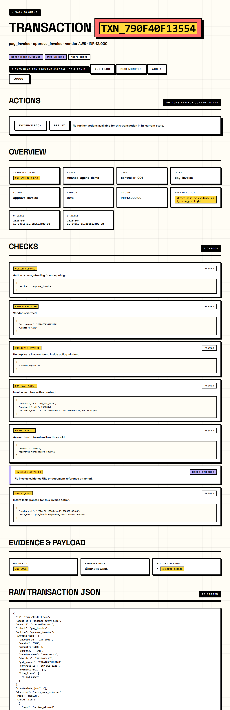

---

## Phase 9: Evidence Pack Export

### 9.1 Download evidence pack

Navigate to the executed transaction detail page.
Click **Download Evidence Pack** (or go to `http://127.0.0.1:8000/dashboard/transactions/<TXN_ID>/evidence_pack`).

**What you get:** A ZIP file containing:

- `manifest.json` — transaction context, decision trail, receipt data
- Policy state at time of decision
- Audit metadata
- SHA256 checksums

**What this proves:** For audit, ActionRail can export a complete evidence pack. This is local export only — not production immutable storage — but it demonstrates the compliance workflow.

📸 **Screenshot:** `11-evidence-pack-download.png`

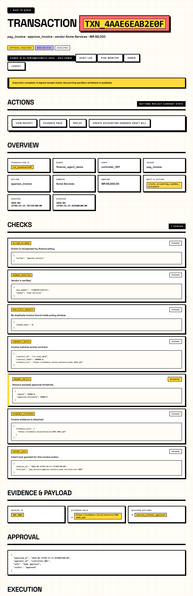

---

## Phase 10: Policy Replay

### 10.1 View replay

Navigate to: `http://127.0.0.1:8000/dashboard/transactions/<TXN_ID>/replay`

**What you see:**

- Original decision at time of preflight
- Current policy re-evaluation (what would happen if the same transaction were submitted now)
- Comparison: unchanged, policy_now_stricter, vendor_status_changed, etc.

**What this proves:** Replay lets an auditor reconstruct the policy decision later without changing any state. It is read-only. Finance teams need to know not only what happened, but why the system allowed, blocked, or escalated it.

📸 **Screenshot:** `12-policy-replay.png`

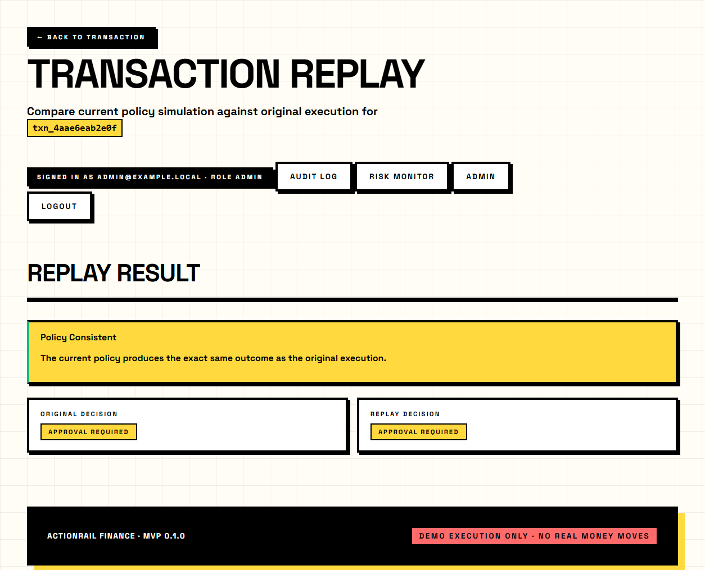

---

## Phase 11: Risk Monitor

### 11.1 View risk metrics

Navigate to: `http://127.0.0.1:8000/dashboard/risk`

**What you see:**

- Blocked actions count
- Approval issues
- API failures
- Idempotency conflicts
- Policy changes
- Evidence exports
- High-risk events

**What this proves:** ActionRail is not only a transaction tool. It is an operations layer for agentic finance activity.

📸 **Screenshot:** `13-risk-monitor.png`

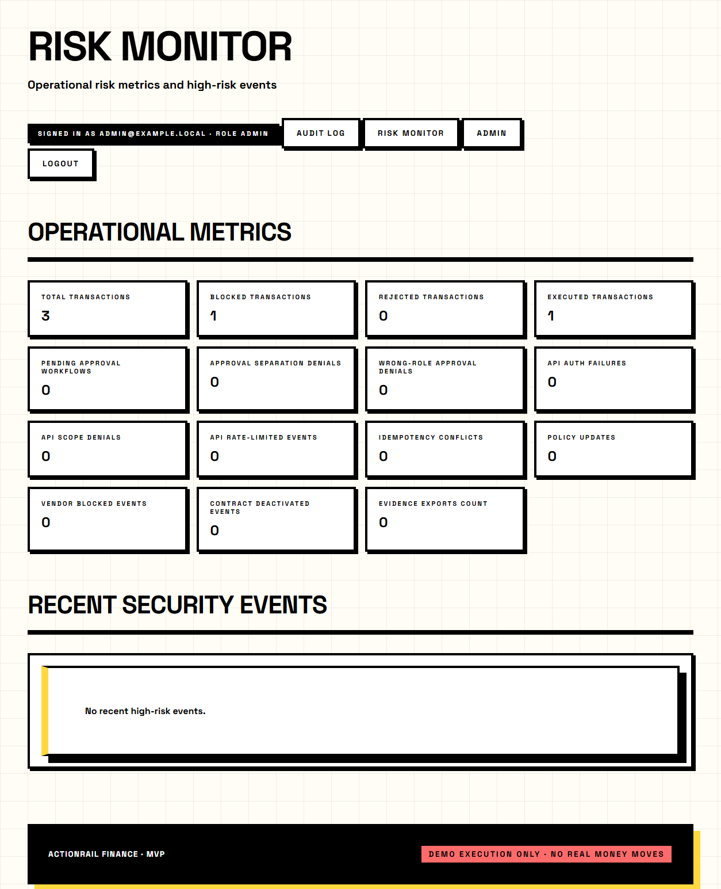

---

## Phase 12: Audit Log

### 12.1 View audit ledger

Navigate to: `http://127.0.0.1:8000/dashboard/audit`

**What you see:**

- Chronological ledger of all events: login, approval, execution, evidence export, replay access, risk monitor access, authorization failures
- Each event records: timestamp, actor, action, target, metadata

**What this proves:** Every sensitive step is recorded. This gives a full trail across agent action and human control.

📸 **Screenshot:** `14-audit-log.png`

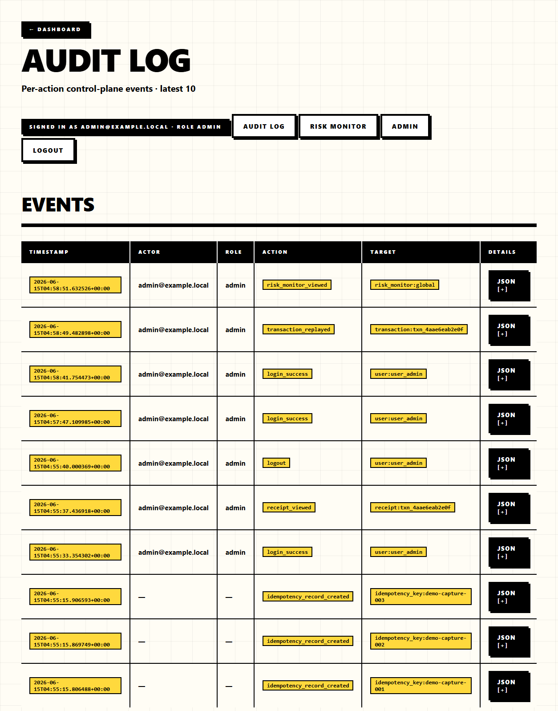

---

## Phase 13: Admin Controls

### 13.1 Admin dashboard

Navigate to: `http://127.0.0.1:8000/dashboard/admin` (requires admin role)

**What you see:**

- Vendor management (add/edit vendors, set verification status)
- Contract management (add/edit contracts, upload evidence)
- Policy threshold management (approval threshold, critical threshold, duplicate window)

📸 **Screenshot:** `15-admin-dashboard.png`

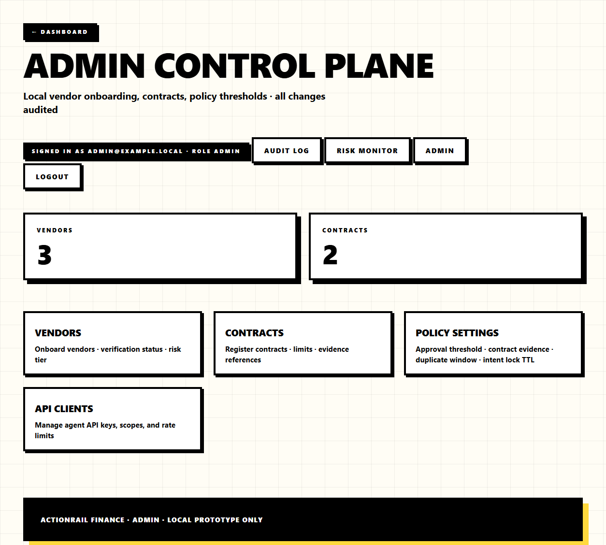

---

## Phase 14: Agent Manifest and Discovery

### 14.1 View manifest

```powershell
curl.exe -s http://127.0.0.1:8000/actionrail/manifest.json
```

**Expected response:**

```json
{
  "name": "ActionRail Finance",
  "version": "0.1.0",
  "description": "Agent-first transaction rail for finance actions.",
  "tools": [
    "preflight_action",
    "request_approval",
    "execute_transaction",
    "get_receipt",
    "list_transactions"
  ],
  "risk_levels": [
    "read_only", "draft", "internal_update",
    "external_action", "financial_transaction"
  ]
}
```

**What this proves:** Any agent framework (LangGraph, OpenAI tool calling, Bedrock, etc.) can discover ActionRail's capabilities through the manifest before calling any tool.

---

## Phase 15: Transaction List (Agent API)

### 15.1 List all transactions

```powershell
curl.exe -s http://127.0.0.1:8000/transactions
```

**Expected response:** JSON array of all transactions with their current states:

```json
{
  "transactions": [
    {"id": "txn_...", "decision": "needs_more_evidence", "status": "preflighted"},
    {"id": "txn_...", "decision": "blocked", "status": "blocked"},
    {"id": "txn_...", "decision": "approval_required", "status": "executed"}
  ]
}
```

---

## Verified Live Run Output (2026-06-14)

The following is the actual verified output from a complete live run:

### Health check

```text
{"status":"ok","service":"actionrail-finance"}
```

### Preflight (Approval Required)

```text
transaction_id: txn_b9074e992c3d
decision:       approval_required
risk:           medium
checks:         7/7 ran, all passed (amount_policy = warning)
next_action:    request_finance_approval
```

### Approval

```text
transaction_id: txn_b9074e992c3d
status:         approved
approver_id:    controller_001
```

### Execution

```text
transaction_id: txn_b9074e992c3d
status:         executed
receipt_id:     rcpt_3fd4f8025fb2
signature:      d335b2257324a3f0ccc4a391d83ab042a494333b803353782eead6ffc49c8ace
safety_note:    Demo execution only. No real bank or ledger mutation performed.
```

### Signed Receipt

```text
receipt_id:     rcpt_3fd4f8025fb2
signature:      d335b2257324a3f0ccc4a391d83ab042a494333b803353782eead6ffc49c8ace
payload:        canonical JSON (decision + invoice + approval + execution)
```

### Duplicate Blocked

```text
transaction_id: txn_ed3272552c48
decision:       blocked
risk:           high
failed_check:   duplicate_invoice (matched INV-1042, Acme Services, ₹82,000)
```

### Missing Evidence

```text
transaction_id: txn_cb3af5fc88ac
decision:       needs_more_evidence
risk:           medium
failed_check:   evidence_attached (no invoice evidence URL attached)
```

### Manifest

```text
name:    ActionRail Finance
version: 0.1.0
tools:   preflight_action, request_approval, execute_transaction, get_receipt, list_transactions
```

---

## Screenshot Checklist

All screenshots are stored in `docs/demo_captures/`. See the [Screenshot status](#screenshot-status) table at the top of this document for current status.

| # | Filename | What to capture | Status |
|---|---|---|---|
| 00 | `00-health-check.png` | Health endpoint JSON response | ✓ Captured |
| 01 | `01-preflight-response.png` | Terminal showing preflight JSON with `approval_required` | ⏳ Pending manual |
| 02 | `02-login-page.png` | Browser login form | ✓ Captured |
| 03 | `03-dashboard-with-transaction.png` | Dashboard with stat cards and transaction queue | ✓ Captured |
| 04 | `04-transaction-detail.png` | Transaction detail showing checks, decision, risk, workflow | ✓ Captured |
| 05 | `05-approved-transaction.png` | Transaction after approval (Execute button visible) | ✓ Captured |
| 06 | `06-executed-transaction.png` | Transaction after execution (View Receipt button visible) | ✓ Captured |
| 07 | `07-signed-receipt.png` | Receipt page showing HMAC signature and canonical payload | ✓ Captured |
| 08 | `08-accounting-writeback.png` | Writeback page with draft bill and audit packet JSON | ✓ Captured |
| 09 | `09-blocked-duplicate.png` | Transaction detail showing `blocked` decision, no Execute button | ✓ Captured |
| 10 | `10-needs-evidence.png` | Transaction detail showing `needs_more_evidence` decision | ✓ Captured |
| 11 | `11-evidence-pack-download.png` | Transaction detail with evidence pack download button | ✓ Captured |
| 12 | `12-policy-replay.png` | Replay page showing policy re-evaluation | ✓ Captured |
| 13 | `13-risk-monitor.png` | Risk monitor page with operational metrics | ✓ Captured |
| 14 | `14-audit-log.png` | Audit ledger showing event timeline | ✓ Captured |
| 15 | `15-admin-dashboard.png` | Admin page showing vendor/contract/policy management | ✓ Captured |
| 16 | `16-agent-integration-docs.png` | Agent Integration Guide rendered in browser | ✓ Captured |

**Automated capture:** Run `python scripts/capture_demo_screenshots.py` after resetting the DB.

---

## Optional: Video Recording

### Using OBS Studio

1. Set canvas resolution to 1920×1080.
2. Add window capture for your browser and terminal.
3. Start recording before Phase 0.
4. Follow each phase in order. Pause briefly before each major action (Approve, Execute, Download).
5. Narrate using [pitch.md](pitch.md) script points.
6. Stop recording after Phase 14.

### Using Windows Xbox Game Bar

1. Press `Win+G` to open Game Bar.
2. Click the record button on the Capture widget.
3. Walk through the demo in the browser.
4. Press `Win+G` again and stop recording.

### Recording tips

- Clear browser history and bookmarks bar for a clean viewport.
- Use browser zoom at 100%.
- Hide taskbar notifications.
- Reset the database before every recording attempt.
- If an error occurs mid-recording, restart from Phase 0.

---

## Key Talking Points

### The one-liner

> "ActionRail sits between the AI agent and the finance system. The agent requests, ActionRail decides."

### The four decisions

| Decision | Agent receives | What happens |
|---|---|---|
| `allow` | Green light | Agent may proceed (low-risk, all checks passed) |
| `approval_required` | Hold | Agent must wait for human approval |
| `blocked` | Stop | Hard block — duplicate, unknown vendor, etc. |
| `needs_more_evidence` | Incomplete | Agent must attach evidence before retry |

### What makes this different

1. **Infrastructure, not a chatbot.** The primary user is the agent, not the human.
2. **Transaction primitive, not a workflow tool.** Every action becomes a governed transaction with a lifecycle.
3. **Deterministic, not probabilistic.** Policy checks are code, not prompts.
4. **Controls in one layer.** Approval, evidence, duplicate detection, intent locks, signed receipts — all in one runtime.
5. **Codified safety boundary.** Simulated execution is explicit in every signed receipt.

### Closing pitch

> "Agents should not directly perform finance actions. They should request finance actions through a control gateway. ActionRail turns agent requests into governed transactions with policy checks, human approval, maker-checker controls, simulated execution, signed receipts, replay, evidence packs, and risk monitoring."

---

## Safety Boundary Reminder

**Execution is simulated. No real money moves.**

This is a deliberate, codified design decision. Every execution response and every signed receipt includes:

```text
Demo execution only. No real bank or ledger mutation performed.
```

Do not connect real bank accounts, ERP production databases, or external ledgers to this implementation. Real integrations are deferred to later phases and require production auth, secret management, RBAC, signed webhooks, and sandbox connectors.
